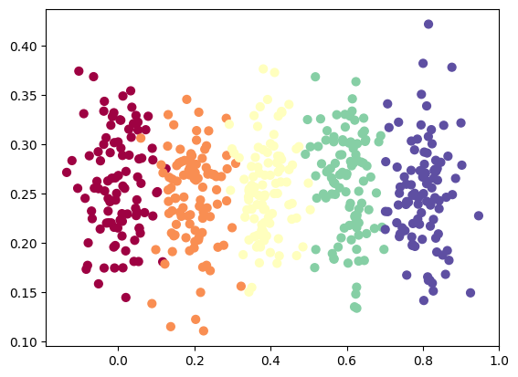
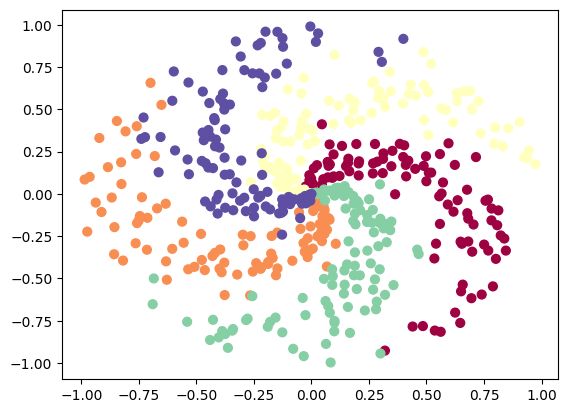

# Simple datasets to learn Machine Learning in Deno

## Vertical

Generates a distribution with multiple classes of points spread along the X axis:



### Optional parameters

#### `dispersion`

Determines the spread of points around their center. With `dispersion = 0` all points in a class are
at the same coordinates. Using values higher than 0.1 may make it difficult to classify the dataset.
The default value is 0.05.

## Spiral

Generates a spiral, where each class is a spiral's branch, e.g. classes:



You can set how many classes there'are in dataset and how many samples (i.e. points) there are **in
each class**.

```ts
const { X, y } = createSpiral({ samples: 20, classes: 3 });
```

### Optional parameters

#### `dispersion`

Controls how much points scattered around branch axis, e.g. with `dispersion = 0` you get:


Varies, basically from 0 to 0.5. Although higher values are possible but the spiral becomes
unrecognizable. Default value is 0.2.

### `twist`

Controls distance between points by the circle, but basically you can think of it as accepting
values `1` or `2` and controlling how much the spiral is twisted, e.g. here's `twist = 2`:


And here's with `twist = 1`:


## TODO

- Circular
